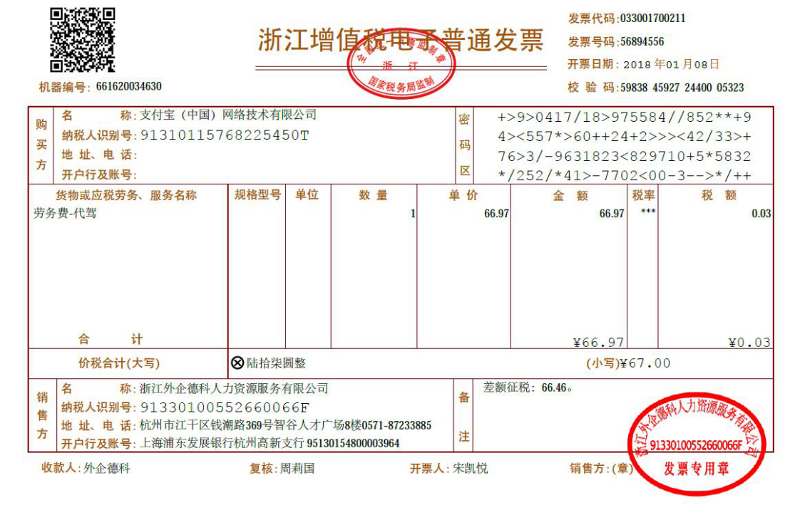

# 批量识别增值税发票

发票识别这项技术早已集成在很多企业的报销系统中了，这似乎不是什么新鲜玩意。

但是对于审计来说，这些都是不能使用的，为啥？还不是因为穷嘛。

怎么办？自己动手，丰衣足食！

之前我有好几次在探索免费的方案，之前看过百度提供的API。


但是调用是有次数限制的。对于我的工作IT审计来说，要做那肯定是需要对几万、几十万以上的发票进行核查。这肯定不行的。

只能去找开源的ocr项目，之前看到了paddleocr发现可以很好的识别发票。


但当时我感觉这个是非结构化的文本，而想要提取出我想要的关键信息，似乎没有想好怎么做。

直到我前天逛B站的时候，看到这个UP主的思路：

https://www.bilibili.com/video/BV1JK4y1M7Sd

直接用正则表达式把公司名称、金额、发票号等信息提取出来不就完了吗？

终于跳出了想结构化数据的困境。

> Talk is cheap, show me your code.

代码我们一共分两步：

1. 将PDF转成PNG图片。
2. 利用paddleocr识别图片信息

## PDF转PNG图片

需要安装fitz和PyMuPDF两个包：

```bash
pip install fitz PyMuPDF
```

`pdf2img.py`文件代码:
```python
import sys, fitz, os, datetime

def pyMuPDF_fitz(pdf_path, image_path):
    pdfDoc = fitz.open(pdf_path)
    base_name = os.path.basename(pdf_path)
    pdf_name = os.path.splitext(base_name)[0]
    if pdfDoc.pageCount == 1:
        flag = True
    else:
        flag = False
    for pg in range(pdfDoc.pageCount):
        page = pdfDoc[pg]
        rotate = int(0)
        # 每个尺寸的缩放系数为1.3，这将为我们生成分辨率提高2.6的图像。
        # 此处若是不做设置，默认图片大小为：792X612, dpi=96
        zoom_x = 2 #(1.33333333-->1056x816)   (2-->1584x1224)
        zoom_y = 2
        mat = fitz.Matrix(zoom_x, zoom_y).preRotate(rotate)
        pix = page.getPixmap(matrix=mat, alpha=False)
        if not os.path.exists(image_path):#判断存放图片的文件夹是否存在
            os.makedirs(image_path) # 若图片文件夹不存在就创建
        if flag:
            image_name = pdf_name + '.png' 
        else:
            image_name = pdf_name + '_%s.png' % pg
        image_path = os.path.join(image_path,image_name)
        pix.writePNG(image_path)#将图片写入指定的文件夹内

if __name__ == "__main__":
    pdfPath = './TJB/餐饮94.pdf'
    imagePath = './img'
    pyMuPDF_fitz(pdfPath, imagePath)
```
函数`pyMuPDF_fitz(pdf_path, image_path)`会将给定的pdf文件夹的文件转换为png图片并保存到image_path文件夹下。

> 代码来源：https://www.jianshu.com/p/f57cc64b9f5e

## paddleocr识别发票信息

需要安装`paddleocr`包：

```bash
pip install paddleocr
```

编写`ocr.py`文件代码：

```python
from paddleocr import PaddleOCR
import re
from PIL import Image
import pandas as pd

def invoice_ocr(path):
    result = PaddleOCR().ocr(path)
    inform = []
    for line in result:
        inform.append(line[1][0])

    String2 = '【' + '】【'.join(inform) + '】'
    print(String2)
    if '发' in String2 or '票' in String2:
        print('yes')
    else:
        print('no')
        im = Image.open(path)
        out = im.transpose(Image.ROTATE_180)
        out.save(path)
        result = PaddleOCR().ocr(path)
        inform = []
        for line in result:
            inform.append(line[1][0])
        String2 = '【' + '】【'.join(inform) + '】'
    # 发票号码
    try:
        number = re.findall('(?<!\d)(\d{8})】',String2)[0]
    except:
        number=''
    invoice2 = re.sub('[a-zA-Z]','',String2)
    # 发票代码
    try:
        code = re.findall('(?<!\d)(\d{10,12})】',invoice2)[0]
    except:
        code = '' 
    # 校验码
    try:
        judge = re.findall('校验码[:：](\d+)】',invoice2)[0]
    except:
        judge = ''
    # 发票日期
    try:
        ymd = re.findall('\d{4}年\d{2}月\d{2}日',invoice2)[0]
    except:
        ymd = ''
    # 发票金额
    try:
        amounts = re.findall('￥\s*([0-9]*?\.\d*?)】',invoice2)
        amounts = [float(i) for i in amounts]
        amounts.sort()
        amount = amounts[-2]
        total_price = amounts[-1]
    except:
        amount = ''
        total_price = ''
    # 税率
    try:
        tax = re.findall('【(\d{1,2}%)】',invoice2)[0]
    except:
        tax = ''
    # 购买方
    try:
        purch_name = re.findall('称[:：](.*?)】',invoice2)[0]
    except:
        purch_name = ''
    # 销售方
    try:
        sale_name = re.findall('称[:：](.*?)】',invoice2)[1]
    except:
        sale_name = ''
    try:
        purch_id = re.findall('纳税人识别号[:：](\d+)】',invoice2)[0]
        sale_id = re.findall('纳税人识别号[:：](\d+)】',invoice2)[1]
    except:
        purch_id = ''
        sale_id = ''
    info = [[path,purch_name,purch_id,sale_name,sale_id,code,number,judge,ymd,total_price,amount,tax]]
    df = pd.DataFrame(info,columns=['路径','购买方','购买方纳税人识别号','销售方','销售人纳税人识别号','发票代码','发票号','校验码','日期','总金额','销售金额','税率'])
    return df
        

if __name__ == "__main__":
    path = './img/2021-06-14餐饮45.9.png'
    result = invoice_ocr(path)
    print(result)
```


我们以这张发票为例，调用`invoice_orc(path)`函数，能够返回我们需要的关键信息，返回的格式为DataFrame格式


## 批量识别发票并生成Excel

有了上面两个功能函数，我们只需要循环将所有PDF转成PNG图片，再循环识别每张图片，然后将结果保存到Excel即可。

```python
import ocr
from pdf2img import pyMuPDF_fitz
import os
import pandas as pd

def get_file_path(dictory):
    paths = os.listdir(dictory)
    paths = [os.path.join(dictory,path) for path in paths]
    return paths

if __name__ == "__main__":
    pdf_dictory = './pdf'
    img_dictory = './img'
    paths = get_file_path(pdf_dictory)
    for path in paths:
        pyMuPDF_fitz(path,img_dictory)
    print('pdf转png完成')
    paths = get_file_path(img_dictory)
    df_list = []
    for path in paths:
        df_list.append(ocr.invoice_ocr(path))
    df = pd.concat(df_list)
    df.to_excel('output.xlsx',index=False)
```
需要注意的是：
```python
import ocr
from pdf2img import pyMuPDF_fitz
```
这里我们引入的两个模块就是前面我们写的两个python文件。

接下来，我将上一个项目出差的需要报销的电子发票进行测试：

我将所有PDF放入`pdf`文件夹中，然后运行代码：


测试发现，购买方名称、销售方名称、发票代码、发票号、校验码、日期、总金额、销售金额都是能完美识别提取出来的。

纳税人识别号并不能100%搞出来。

不过这对于我来说已经足够了，能够本地调用没有次数限制。

我发现以前报销的时候我还一个一个的去统计金额，还给PDF按金额命名去找，有了这个，下次报销直接一运行就全统计了。Nice。

希望以后哪个项目需要核查发票的时候，能派上用场。


